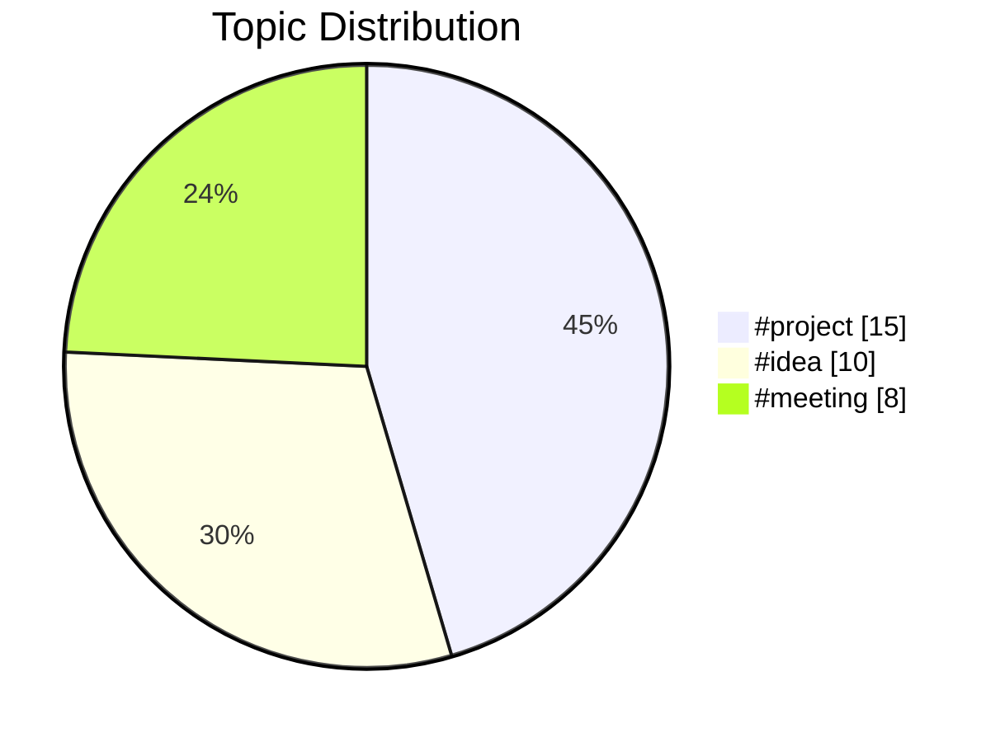
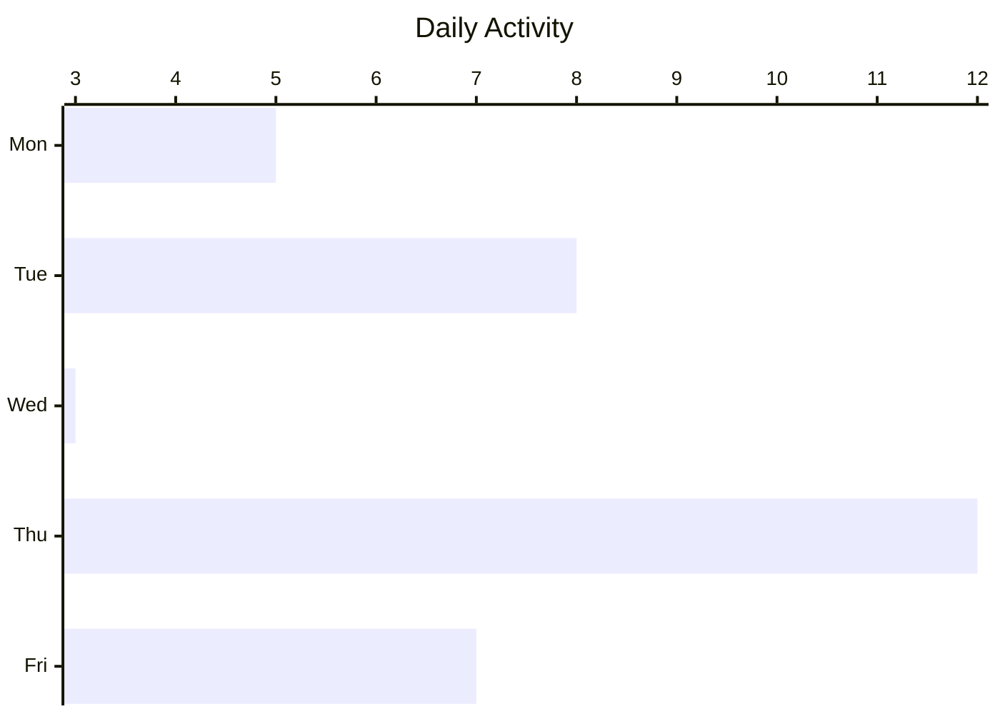

# Vault Insights

Generate actionable insights from your Obsidian vault - daily/weekly summaries, aggregated todo lists, topic analysis, and content visualizations.

## Features

### Daily & Weekly Summaries

Automatically generate markdown notes summarizing your vault activity:

- Notes created and modified in the period
- Task completion statistics
- Topic distribution with Mermaid charts
- Direct links to touched notes

### Aggregated Todo List

Create a unified task list from your entire vault or specific folders:

- Extract all `- [ ]` and `- [x]` tasks
- Group by source file, due date, or tag
- Track completion progress with visualization
- Support for due date syntax (`📅 2024-01-26` or `due:: 2024-01-26`)

### Topic Frequency Analysis

Understand what you write about most:

- Tag frequency across your vault
- Heading patterns (H1 and H2)
- Internal link analysis
- Visual charts showing topic distribution

### Content Visualization

Embedded Mermaid charts in your generated notes:

- **Pie charts**: Content distribution by topic or folder
- **Bar charts**: Topic frequency, daily activity
- **Tables**: Ranked topic listings

## Installation

### From Community Plugins (Recommended)

1. Open Obsidian Settings
2. Go to Community Plugins → Browse
3. Search for "Vault Insights"
4. Click Install, then Enable

### Manual Installation

1. Download `main.js`, `manifest.json`, and `styles.css` from the latest release
2. Create a folder `vault-insights` in your vault's `.obsidian/plugins/` directory
3. Copy the downloaded files into this folder
4. Restart Obsidian and enable the plugin in Settings → Community Plugins

## Commands

| Command | Description |
|---------|-------------|
| **Generate daily summary** | Create a summary note for today's vault activity |
| **Generate weekly summary** | Create a summary note for the current week |
| **Generate todo list** | Aggregate all tasks from configured folders |
| **Analyze vault topics** | Generate topic frequency analysis |
| **Refresh all insights** | Regenerate all insight notes |

Access these commands via the Command Palette (`Ctrl/Cmd + P`).

## Settings

### Summary Settings

| Setting | Description | Default |
|---------|-------------|---------|
| Summary Folder | Where generated notes are saved | `Insights` |
| Daily Summary | Enable daily summary generation | On |
| Weekly Summary | Enable weekly summary generation | On |
| Summary Time | Scheduled generation time | `09:00` |

### Todo Settings

| Setting | Description | Default |
|---------|-------------|---------|
| Source Folders | Folders to scan for tasks (empty = all) | `[]` |
| Exclude Folders | Folders to skip when scanning | `templates, archive` |
| Group By | How to organize tasks | `file` |

### Topic Analysis Settings

| Setting | Description | Default |
|---------|-------------|---------|
| Topic Sources | What to analyze (tags, headings, links) | `tags, headings` |
| Max Topics | Maximum topics to display | `20` |
| Max Chart Items | Maximum items in charts | `10` |

### Optional: Ollama Integration

| Setting | Description | Default |
|---------|-------------|---------|
| Enable Ollama | Use local LLM for smart extraction | Off |
| Ollama URL | Local Ollama server address | `http://localhost:11434` |
| Ollama Model | Model to use for extraction | `llama3` |

## Generated Note Structure

All generated notes include:

- **YAML frontmatter** with metadata (generator, date range, tags)
- **Overview section** with key statistics
- **Mermaid visualizations** for data
- **Detailed listings** with wikilinks to source notes

Example frontmatter:

```yaml
---
title: "Daily Summary - 2024-01-26"
generated: 2024-01-26T10:00:00.000Z
generator: daily-summary
period: daily
startDate: 2024-01-26
endDate: 2024-01-26
tags: [vault-insights, daily-summary]
---
```

## Visualizations

Vault Insights uses Mermaid charts, which render natively in Obsidian without any additional dependencies.

### Supported Chart Types

**Pie Chart** - Topic and folder distribution



**Bar Chart** - Frequency and activity data



## Ollama Setup (Optional)

For AI-powered topic extraction (desktop only):

1. Install [Ollama](https://ollama.ai)
2. Pull a model: `ollama pull llama3`
3. Start Ollama: `ollama serve`
4. Enable Ollama in plugin settings

**Note**: Ollama features only work on desktop. Mobile users can still use all other features.

## FAQ

### Does this work on mobile?

Yes! All core features work on mobile. The optional Ollama integration is desktop-only.

### Will this slow down my vault?

Vault Insights uses Obsidian's built-in MetadataCache, which means files aren't re-read from disk. Generation is efficient even with large vaults (1000+ notes).

### Can I customize the output?

Generated notes are standard markdown files. You can edit them after generation. Future versions may include templates.

### Where are insights saved?

By default, insights are saved to an `Insights` folder in your vault root. You can change this in settings.

### How do I exclude certain folders?

Add folder names to the "Exclude Folders" setting (comma-separated). Tasks and topics from these folders won't appear in generated notes.

## Privacy

- **100% Local**: All processing happens on your device
- **No telemetry**: No data is collected or sent anywhere
- **No API keys**: Core features require no external accounts
- **Ollama is local**: Even AI features use a locally-running model

## Support

- [Report an issue](https://github.com/yourusername/vault-insights/issues)
- [Feature requests](https://github.com/yourusername/vault-insights/discussions)

## License

MIT License - see [LICENSE](LICENSE) for details.

---

Made with ❤️ for the Obsidian community
